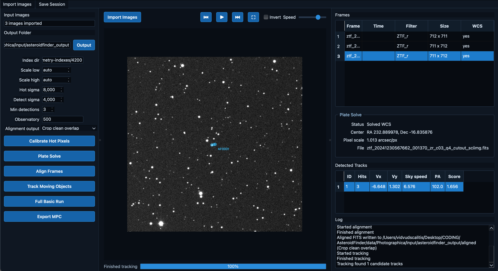
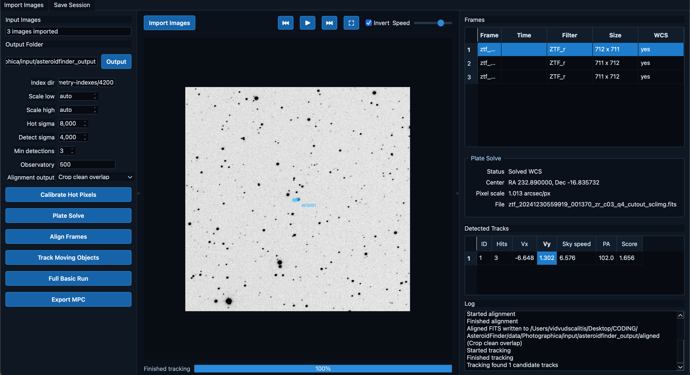

# AsteroidFinder

AsteroidFinder is a Python library and desktop app for real astronomical image
work: plate solving, FITS inspection, alignment, blinking, hot-pixel cleanup,
moving-object tracking, known-object lookup, and MPC-style export.

- Load FITS, FIT, JPEG, PNG, TIFF images into calibrated numeric arrays.
- Read solved WCS from FITS headers when present.
- Run real astrometry.net plate solving through `solve-field` when installed.
- Detect stars/sources with SEP.
- Align frames with real star-pattern matching using `astroalign`.
- Stack aligned images.
- Track moving-object candidates across an aligned image sequence.
- Query known solar-system objects with SkyBoT when WCS is available.
- Export measured detected-track observations to MPC-style text and CSV.
- Generate per-track diagnostic plots with pixel motion, RA/Dec trends, speed,
  position angle, and fit residuals.

This project does not fake plate solving. If an image has no embedded WCS and
astrometry.net is unavailable or cannot solve it, solving fails with a clear
exception.

## Quick Start

```bash
python3 -m pip install -e ".[dev]"
asteroidfinder inspect data/raw/*.fit
asteroidfinder solve data/raw/example.fit --out solved
asteroidfinder align data/raw/*.fit --out aligned
asteroidfinder track data/raw/*.fit --out tracks.csv
```

For real blind plate solving install astrometry.net locally and make sure
`solve-field` is on your `PATH`, with suitable index files for your field of
view.

## Plate Solving Setup

Check your machine:

```bash
asteroidfinder doctor \
  --index-dir ~/astrometry-indexes/4200 \
  --sample-image data/raw/example.fit \
  --scale-low 1.0 \
  --scale-high 1.5
```

Download a starter index file for a ~2 degree field:

```bash
asteroidfinder install-indexes --index-dir ~/astrometry-indexes/4200 --series 4210
```

Then solve with:

```bash
asteroidfinder solve data/raw/example.fit \
  --index-dir ~/astrometry-indexes/4200 \
  --scale-low 1.0 \
  --scale-high 1.5
```

The bundled telescope demo can be run with:

```bash
python demo/run_demo.py --use-raw --index-dir ~/astrometry-indexes/4200
```

## Demos

- `demo/` runs the local telescope workflow.
- `demo2/` runs the clean ZTF Photographica workflow and produces a structured
  report with speed comparison, SkyBoT match tables, and track diagnostics.

## Desktop App

Install the optional desktop UI dependencies:

```bash
python3 -m pip install -e ".[desktop]"
```

Then launch the early dark-themed desktop app:

```bash
asteroidfinder-desktop
```

The desktop app can import selected FITS images, preview and blink frames,
invert the view, run calibration, plate solving, alignment, tracking,
known-object lookup, one-click reports, PNG diagnostics, and measured-track MPC
exports through the same library pipeline.





Current desktop inspection features:

- cached FITS preview and blink playback
- WCS status and frame metadata table
- selected-track overlay with a single toggle for current-frame circle or full
  motion path
- embedded Matplotlib movement chart with pan/zoom toolbar
- per-detection measurement table with pixel, SNR, flux, residual, and WCS
  coordinates when available
- report window for output CSVs and generated HTML report

## Python API

```python
from asteroidfinder import load_image, solve_image, align_images, track_moving_objects, plot_track_diagnostics

frame = load_image("data/raw/image.fit")
solution = solve_image("data/raw/image.fit")
aligned = align_images(["data/raw/001.fit", "data/raw/002.fit"])
tracks = track_moving_objects(["data/raw/001.fit", "data/raw/002.fit", "data/raw/003.fit"])
plot_track_diagnostics(tracks, "diagnostics")
```
